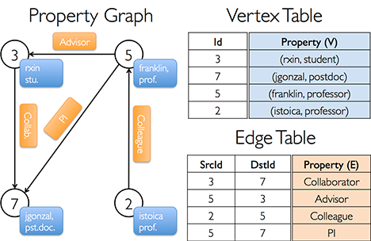

Graph Generating and Data Loading
=================================

This tutorial describes the most basic operations in GraphX, which is constructing a graph.

Specifically, we will teach you how to **create a graph manually (edge by edge, vertex by vertex)**, and how to **load data from an existing file to create a graph**. In addition, we will also **introduce some other APIs**, to help you check your graph.

Parts of the API source codes we use in this tutorial are listed after each section. If you want to find some APIs, use `Ctrl+F`.  You can just skip the source code part, or check it for further study and references.

Note: All the operations below do work on spark-shell environment. You can set up your `$PATH` of Spark, and then type `spark-shell` in the terminal to launch it.


---


Create the Graph Manually
-----------

Before running, you need to learn how to walk step by step.

At the beginning of this tutorial, you will be introduced to create a graph all by yourself. You need to enter all the details of each vertex and edge. By typing these codes, you will get familiar with GraphX quickly.

### Step 1: Import some libraries

  * Just type:

  ```scala
  scala> import org.apache.spark._
  scala> import org.apache.spark.graphx._
  scala> import org.apache.spark.rdd.RDD
  ```

### Step 2: Type in the attributes of the graph

  * Follow the example in [1]. The structure of the graph is as following:

  [](images/property_graph.png)

  * This graph has such type signature:

  ```scala
  val userGraph: Graph[(String, String), String]
  ```
  `(String, String)` means the type of vertex attributes, and the third `String` means the type of edge attributes. Type in the following codes:

  ```scala
  // val sc: SparkContext
  // Create an RDD for the vertices
  val users: RDD[(VertexId, (String, String))] =
      sc.parallelize(Array((3L, ("rxin", "student")), (7L, ("jgonzal", "postdoc")),
                           (5L, ("franklin", "prof")), (2L, ("istoica", "prof"))))
  // Create an RDD for edges
  val relationships: RDD[Edge[String]] =
      sc.parallelize(Array(Edge(3L, 7L, "collab"), Edge(5L, 3L, "advisor"),
                           Edge(2L, 5L, "colleague"), Edge(5L, 7L, "pi")))
  // Define a default user in case there are relationship with missing user
  val defaultUser = ("John Doe", "Missing")
  ```

### Step 3: Create your graph

  * Type the following code to create your first graph in GraphX:

  ```scala
  val graph = Graph(users, relationships, defaultUser)
  ```
  `users` is a vertex RDD, and `relationships` is a edge RDD. The `defaultVertexAttr` here is `defaultUser`. Finally the shell returns:

  ```scala
  graph: org.apache.spark.graphx.Graph[(String, String),String] = org.apache.spark.graphx.impl.GraphImpl@28796d0e
  ```

### Step 4: Check your graph

  * Let's count how many post doctors there are.

  ```scala
  scala> graph.vertices.filter { case (id, (name, pos)) => pos == "postdoc" }.count
  ```

  It returns `res0: Long = 1`, which represents `Vertex 7`. We can also count the edges whose source vertex ID is greater than its destination vertex ID:

  ```scala
  scala> graph.edges.filter(e => e.srcId > e.dstId).count
  ```

  It returns `res1: Long = 1` which is `Vertex 5 --> 3`.

  * If we view the type of `triplets` by

  ```scala
  scala> graph.triplets
  ```
  It returns

  ```scala
  res3: org.apache.spark.rdd.RDD[org.apache.spark.graphx.EdgeTriplet[(String, String),String]] = MapPartitionsRDD[22] at mapPartitions at GraphImpl.scala:51
  ```

  whose type is `EdgeTriplet[(String, String),String]]`, the same as the `graph`. Let’s see the all triplets by

  ```scala
  scala> graph.triplets.collect
  ```

  It returns all the edges with its vertices and attributes:

  ```scala
  res4: Array[org.apache.spark.graphx.EdgeTriplet[(String, String),String]] = Array(((3,(rxin,student)),(7,(jgonzal,postdoc)),collab), ((5,(franklin,prof)),(3,(rxin,student)),advisor), ((2,(istoica,prof)),(5,(franklin,prof)),colleague), ((5,(franklin,prof)),(7,(jgonzal,postdoc)),pi))
  ```

  Likewise, using the following codes can view the collections of `vertices` and `edges`.

  ```scala
  scala> graph.vertices.collect
  scala> graph.edges.collect
  ```

  * We can use some `map` operations on the triplets:

  ```scala
  val facts: RDD[String] =
  graph.triplets.map(triplet =>
      triplet.srcAttr._1 + " is the " + triplet.attr + " of " + triplet.dstAttr._1)
  facts.collect.foreach(println(_))
  ```

  It returns

  ```scala
  rxin is the collab of jgonzal
  franklin is the advisor of rxin
  istoica is the colleague of franklin
  franklin is the pi of jgonzal
  ```


Loading data from an exsiting file
----------------------------------

Now, we could start to run.

In this part, we use `web-Google` open data set as an example. The data was released in 2002 by Google as a part of [Google Programming Contest](http://www.google.com/programming-contest/). Nodes represent web pages and directed edges represent hyperlinks between them [2].

The graph contains **875,713** nodes and **5,105,039** edges. You can find its detailed information in [2], and download it either from [snap.stanford.edu](https://snap.stanford.edu/data/web-Google.txt.gz) (web-Google.txt.gz) or [github.com/yuhc](https://github.com/yuhc/web-dataset/tree/master/web-Google) (three different sizes of txt files). The full size of the data is about 75.4 MB. You can click here and have a look at the data format.

### Step 1: Import the data into HDFS

  * The default web view URL of HDFS is `http://192.168.17.240:50070` (Replace `192.168.17.240` with **your own IP or `localhost`**). Click "Utilities –> Browse the file system", you can see the directive structure of HDFS. The default URL of HDFS is `hdfs://192.168.17.240:9222` (Replace `192.168.17.240` with **your own IP or `localhost`**, and replace `9222` with **your own port of HDFS**)

  Note: The following operations [3] are not work on **saprk-shell**, but in **your terminal**.

  * As for me, I use

  ```
  hdfs dfs -mkdir -p hdfs://192.168.17.240:9222/input/yuhc/web-Google/
  hdfs dfs -put web-Google.txt hdfs://192.168.17.240:9222/input/yuhc/web-Google/web-Google.txt
  hdfs dfs -ls hdfs://192.168.17.240:9222/input/yuhc/web-Google
  ```

  to create the directory and add the file to HDFS.

### Step 2: Import the libraries

  * It is the same as the previous part, just type:

  ```scala
  import org.apache.spark._
  import org.apache.spark.graphx._
  import org.apache.spark.rdd.RDD
  ```

### Step 3: Load data from HDFS

  * Import the `web-Google.txt` from HDFS:

  ```scala
  val graph = GraphLoader.edgeListFile(sc, "hdfs://192.168.17.240:9222/input/yuhc/web-Google/web-Google.txt")
  ```
  It returns

  ```scala
  INFO GraphLoader: It took 10048 ms to load the edges
  graph: org.apache.spark.graphx.Graph[Int,Int] = org.apache.spark.graphx.impl.GraphImpl@225ac5e7
  ```

  * You can modify the number of the workers which help load the file as designating minEdgePartitions:

  ```scala
  val graph = GraphLoader.edgeListFile(sc, "hdfs://192.168.17.240:9222/input/yuhc/web-Google/web-Google.txt", minEdgePartitions = 2)
  ```

### Step 4: Check your graph

  * Now we can count the vertices and edges in the graph:

  ```scala
  scala> graph.vertices.count
  res1: Long = 875713
  scala> graph.edges.count
  res2: Long = 5105039
  ```


Source Code Analysis
--------------------

### Graph, apply, GraphImpl

  * If you look into [Graph.scala](https://github.com/apache/spark/blob/master/graphx/src/main/scala/org/apache/spark/graphx/Graph.scala) carefully, you would find method `apply` which can be used to construct a graph from a collection of vertices and edges with attributes.

  ```scala
  def apply[VD: ClassTag, ED: ClassTag](
        vertices: RDD[(VertexId, VD)],
        edges: RDD[Edge[ED]],
        defaultVertexAttr: VD = null.asInstanceOf[VD],
        edgeStorageLevel: StorageLevel = StorageLevel.MEMORY_ONLY,
        vertexStorageLevel: StorageLevel = StorageLevel.MEMORY_ONLY): Graph[VD, ED] = {
      GraphImpl(vertices, edges, defaultVertexAttr, edgeStorageLevel, vertexStorageLevel)
  }
  ```

  Duplicate vertices are picked arbitrarily. The vertices which are in edge collection `edges` but not in the input vertices collection `vertices` are assigned the `defaultVertexAttr`. The storage strategies can be assigned by designating `edgeStorageLevel` and `vertexStorageLevel`. Finally, method `apply` calls `GraphImpl` to complete the construction.

  * It can be inferred that the constructor of class `Graph` calls org.apache.spark.graphx.impl.`GraphImpl` through method `apply`.

  We can have a look at [GraphImpl.scala](https://github.com/apache/spark/blob/master/graphx/src/main/scala/org/apache/spark/graphx/impl/GraphImpl.scala). The object `GraphImpl` defines several implementations of method `apply`. The previous codes create a graph from a `VertexRDD` and an `EdgeRDD`, so it executes the following codes:

  ```scala
  def apply[VD: ClassTag, ED: ClassTag](
        vertices: RDD[(VertexId, VD)],
        edges: RDD[Edge[ED]],
        defaultVertexAttr: VD,
        edgeStorageLevel: StorageLevel,
        vertexStorageLevel: StorageLevel): GraphImpl[VD, ED] = {
      val edgeRDD = EdgeRDD.fromEdges(edges)(classTag[ED], classTag[VD])
        .withTargetStorageLevel(edgeStorageLevel).cache()
      val vertexRDD = VertexRDD(vertices, edgeRDD, defaultVertexAttr)
        .withTargetStorageLevel(vertexStorageLevel).cache()
      GraphImpl(vertexRDD, edgeRDD)
  }
  ```

  It then calls `GraphImpl(vertexRDD, edgeRDD)`:

  ```scala
  def apply[VD: ClassTag, ED: ClassTag](
        vertices: VertexRDD[VD],
        edges: EdgeRDD[ED]): GraphImpl[VD, ED] = {
      // Convert the vertex partitions in edges to the correct type
      val newEdges = edges.asInstanceOf[EdgeRDDImpl[ED, _]]
        .mapEdgePartitions((pid, part) => part.withoutVertexAttributes[VD])
      GraphImpl.fromExistingRDDs(vertices, newEdges)
  }
  ```

  It continues to call `GraphImpl.fromExistingRDDs(vertices, newEdges)`:

  ```scala
  def fromExistingRDDs[VD: ClassTag, ED: ClassTag](
        vertices: VertexRDD[VD],
        edges: EdgeRDD[ED]): GraphImpl[VD, ED] = {
      new GraphImpl(vertices, new ReplicatedVertexView(edges.asInstanceOf[EdgeRDDImpl[ED, VD]]))
  }
  ```

### GraphLoader, edgeListFile

  * Normally, we create the graph manually only we are practicing the tutorial or doing some debugging. We prefer to read the graph from files automatically when we write a script or a project. GraphX provides a very convenient and useful file reading and graph importing API, `edgeListFile`, which is contained in [GraphLoader.scala](https://github.com/apache/spark/blob/master/graphx/src/main/scala/org/apache/spark/graphx/GraphLoader.scala).

  ```scala
  def edgeListFile(
        sc: SparkContext,
        path: String,
        canonicalOrientation: Boolean = false,
        numEdgePartitions: Int = -1,
        edgeStorageLevel: StorageLevel = StorageLevel.MEMORY_ONLY,
        vertexStorageLevel: StorageLevel = StorageLevel.MEMORY_ONLY)
      : Graph[Int, Int] =
  {
  ...
  ```

  `edgeListFile` can load a graph from an edge list formatted file. The file should only contain two integers in each line, a `source id` and a `target id`. You can comment a line with `#` at the beginning. The file looks like

  ```
  Comment Line
  Source Id <\t> Target Id
  1   -5
  1    2
  2    7
  1    8
  ```

  * Let's look at the parameters of method `edgeListFile`. `sc` is the SparkContext, `path` is the path to the file (e.g., `/home/data/file` or `hdfs://file`), `numEdgePartitions` is the number of partitions for the edge RDD (setting it to -1 if you’d like to use the default parallelism). If you set `canonicalOrientation` to `true`, the edges will have positive direction **(source Id < target Id)** automatically. `edgeStorageLevel` and `vertexStorageLevel` are the desired storage level for the edge and vertex partitions. Here is the code snippet of `canonicalOrientation`:

  ```scala
  if (canonicalOrientation && srcId > dstId) {
      builder.add(dstId, srcId, 1)
      } else {
      builder.add(srcId, dstId, 1)
  }
  ```

---

Reference
---------

1. [Apache GraphX Official Guide](http://spark.apache.org/docs/latest/graphx-programming-guide.html)

2. [Snap Dataset Information](https://snap.stanford.edu/data/web-Google.html)

3. [Apache Hadoop 2.6.0 File System Shell Guide](http://hadoop.apache.org/docs/stable/hadoop-project-dist/hadoop-common/FileSystemShell.html)
