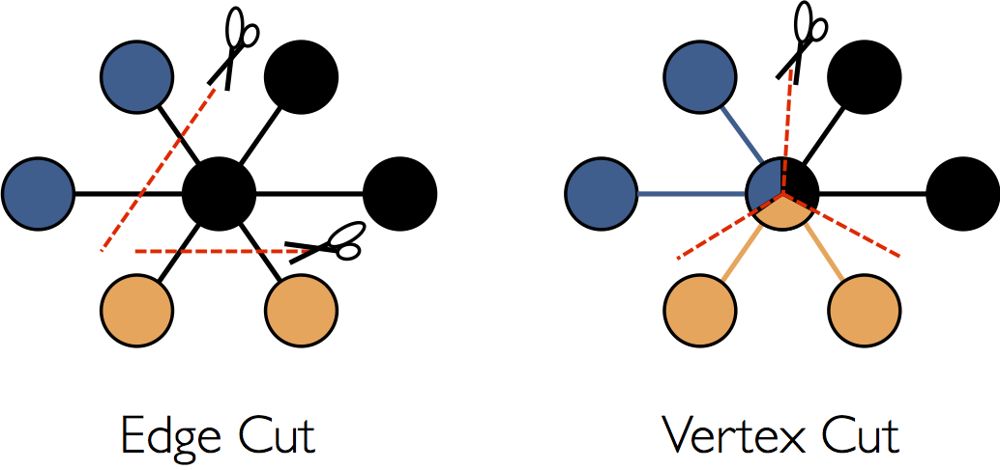
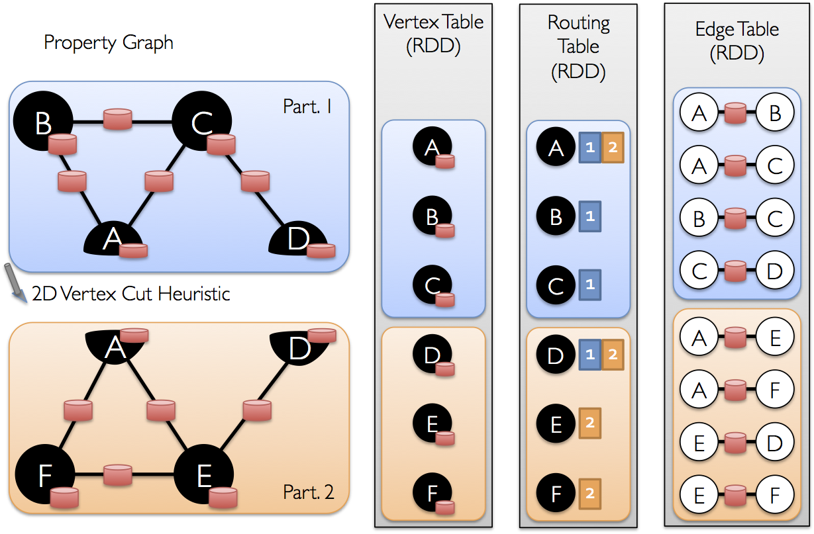

Partition Strategies and Graph Elements
=======================================

Partition Strategy
------------------

To process the graph in a distributed style, the graph needs to be represented in a distributed scheme. Normally, there are two kinds of graph partitioning, **vertex-cut** approach and **edge-cut** approach.


<html><div align=center></div></html>


Spark GraphX adopts a vertex-cut approach to distributed graph partitioning. The strategy is programmed in [PartitionStrategy.scala.](https://github.com/apache/spark/blob/master/graphx/src/main/scala/org/apache/spark/graphx/PartitionStrategy.scala) Let’s look into this file.

```scala
case object RandomVertexCut extends PartitionStrategy{
		override def
		getPartition(src:VertexId,dst:VertexId,numParts:PartitionID):
		PartitionID = {
			math.abs((src, dst).hashCode()) % numParts
		}
}
```

`RandomVertexCut` calculates the hash value of source and destination vertex IDs, using the modulo (by numberOfParts) as the edge’s partition ID. The edges partitioned into the same partition two two vertices have the same direction. `CanonicalRandomVertexCut` partitions the edges regardless of the direction.

```scala
case object CanonicalRandomVertexCut extends PartitionStrategy {
  override def getPartition(src: VertexId, dst: VertexId, numParts: PartitionID): PartitionID = {
    if (src &lt; dst) {
      math.abs((src, dst).hashCode()) % numParts
    } else {
      math.abs((dst, src).hashCode()) % numParts
    }
  }
}
```

Another two partitioning schemes are `EdgePartition1D` and `EdgePartition2D`. In `EdgePartition1D`, edges are assigned to the partitions only according to their source vertices.

```scala
case object EdgePartition1D extends PartitionStrategy {
  override def getPartition(src: VertexId, dst: VertexId, numParts: PartitionID): PartitionID = {
    val mixingPrime: VertexId = 1125899906842597L
    (math.abs(src * mixingPrime) % numParts).toInt
  }
}
```

A very large prime (`mixingPrime`) is used in order to balance the partitions. But such operation can't eliminate the problem totally.

`EdgePartition2D` is a bit more complex. It uses both the source vertex and the destination vertex to calculate the partition. It’s based on the sparse edge adjacency matrix. Here's an example extracted from the source code. Suppose we have a graph with 12 vertices that we want to partition over 9 machines. We can use the following sparse matrix representation:

```scala
/**
  *     __________________________________
  * v0  | P0 *     | P1       | P2    *  |
  * v1  |  ****    |  *       |          |
  * v2  |  ******* |      **  |  ****    |
  * v3  |  *****   |  *  *    |       *  |
  *     ----------------------------------
  * v4  | P3 *     | P4 ***   | P5 **  * |
  * v5  |  *  *    |  *       |          |
  * v6  |       *  |      **  |  ****    |
  * v7  |  * * *   |  *  *    |       *  |
  *     ----------------------------------
  * v8  | P6   *   | P7    *  | P8  *   *|
  * v9  |     *    |  *    *  |          |
  * v10 |       *  |      **  |  *  *    |
  * v11 | * <-E    |  ***     |       ** |
  *     ----------------------------------
  */
```

As you see, `E<v11, v1>` is partitioned into P6. But it's also clear that P1 contains too many edges (far more than other partitions) which results in unbalance of partitioning. So mixingPrime is also used in `EdgePartition2D`.

	case object EdgePartition2D extends PartitionStrategy {
	  override def getPartition(src: VertexId, dst: VertexId, numParts: PartitionID): PartitionID = {
	    val ceilSqrtNumParts: PartitionID = math.ceil(math.sqrt(numParts)).toInt
	    val mixingPrime: VertexId = 1125899906842597L
	    val col: PartitionID = (math.abs(src * mixingPrime) % ceilSqrtNumParts).toInt
	    val row: PartitionID = (math.abs(dst * mixingPrime) % ceilSqrtNumParts).toInt
	(col * ceilSqrtNumParts + row) % numParts
	  }
	}
Let’s look at a simple, realistic graph.


<html><div align=center></div></html>

Vertices A, B and C are in one partition; D, E, F are in the other. The edges are partitioned into two partitions as Edge Table. The Routing Table is very useful which records the cutting status of the vertices.


Graph Elements
--------------

In [Graph.scala](https://github.com/apache/spark/blob/master/graphx/src/main/scala/org/apache/spark/graphx/Graph.scala),  it defines a abstract class `Graph`, representing a graph in which vertices and edges can be associate with arbitrary objects. The comments for `Graph` is as following:

```scala
 /**
 * The Graph abstractly represents a graph with arbitrary objects
 * associated with vertices and edges.  The graph provides basic
 * operations to access and manipulate the data associated with
 * vertices and edges as well as the underlying structure.  Like Spark
 * RDDs, the graph is a functional data-structure in which mutating
 * operations return new graphs.
 */
```

`Graph` contains mainly three objects, `vertices`, `edges` and `triplets`. The triplet is a three-node complete graph. `VD` is the vertex attribute type, and `VE` is the edge attribute type. These three objects contain several sub-objects (vertex, edge and triplet), and are returned as RDDs. They are marked as `@transient`, which means they can't be serialized.

```scala
abstract class Graph[VD: ClassTag, ED: ClassTag] protected () extends Serializable {
  @transient val vertices: VertexRDD[VD]
  @transient val edges: EdgeRDD[ED]
  @transient val triplets: RDD[EdgeTriplet[VD, ED]]
}
```

By the way, Scala provides a `@transient` annotation for fields that should not be serialized at all. If you mark a field as `@transient`, then the framework should not save the field even when the surrounding object is serialized. When the object is loaded, the field will be restored to the default value for the type of the field annotated as `@transient` [1].

`Graph` also provides lots of methods such as

* `persist`: caches the vertices and edges associated with this graph at the specified storage level
* `unpersist`: uncaches both vertices and edges of this graph
* `unpersistVertices`: uncaches only the vertices of this graph
* `cache`: caches the vertices and edges associated with this graph at the previously-specified target storage levels
* `checkpoint`: marks this Graph for checkpointing
* `isCheckpointed`: whether this Graph has been checkpointed or not
* `getCheckpointFiles`: gets the name of the files to which this Graph was checkpointed
* `partitionBy`: repartitions the edges in the graph according to the specific `partitionStrategy`; number of edge partitions can be defined
* `mapVertices`: transforms each vertex attribute in the graph using the map function
* `mapEdges`: transforms each edge attribute in the graph using the map function
* `mapTriplets`: transforms each edge attribute using the map function, passing it the adjacent vertex attributes
* `reverse`: reverses all edges in the graph
* `subgraph`: restricts the graph to only the vertices and edges satisfying the predicates
* `mask`: estricts the graph to only the vertices and edges that are also in `other: Graph[VD2, ED2]`, but keeps the attributes from this graph
* `groupEdges`: merges multiple edges between two vertices into a single edge
* `mapReduceTriplets`: aggregates values from the neighboring edges and vertices of each vertex
* `aggregateMessages`: aggregates values from the neighboring edges and vertices of each vertex; it’s similar to mapReduceTriplets, enabling neighborhood level computation
* `aggregateMessagesWithActiveSet`: similar to aggregateMessages but specific ActiveSet can be designated
* `outerJoinVertices`: joins the vertices with entries in the `other: RDD[(VertexId, U)]` and merges the results using map function `mapFunc: (VertexId, VD, Option[U]) => VD2`

[Graph.scala](https://github.com/apache/spark/blob/master/graphx/src/main/scala/org/apache/spark/graphx/Graph.scala) also includes `object Graph`, which contains a collection of routines used to construct graphs from RDDs.

[GraphOps.scala](https://github.com/apache/spark/blob/master/graphx/src/main/scala/org/apache/spark/graphx/GraphOps.scala) contains additional functionality for `Graph`. It provides the API to return the number of vertices and edges, and the degree of vertices.

The implementation of [[org.apache.spark.graphx.Graph]](https://github.com/apache/spark/blob/master/graphx/src/main/scala/org/apache/spark/graphx/Graph.scala) to support computation on graphs is in [[org.apache.spark.graphx.impl.GraphImpl]](https://github.com/apache/spark/blob/master/graphx/src/main/scala/org/apache/spark/graphx/impl/GraphImpl.scala). The file is located in [[./impl/GraphImpl.scala]](https://github.com/apache/spark/blob/master/graphx/src/main/scala/org/apache/spark/graphx/impl/GraphImpl.scala). Here Graphs are represented using two RDDs: `vertices` (contains vertex attributes and the routing information for shipping vertex attributes to edge partitions), and `replicatedVertexView` (contains edges and the vertex attributes mentioned by each edge). The class `GraphImpl` is heavily based on `VertexRDD`, `EdgeRDD` and `ReplicatedVertexView`.

`VertexRDD` is defined in VertexRDD.scala.

```scala
abstract class VertexRDD[VD](
    @transient sc: SparkContext,
    @transient deps: Seq[Dependency[_]]) extends RDD[(VertexId, VD)](sc, deps) {

  implicit protected def vdTag: ClassTag[VD]
  private[graphx] def partitionsRDD: RDD[ShippableVertexPartition[VD]]
  override protected def getPartitions: Array[Partition] = partitionsRDD.partitions
  ...
)
```

`VertexRDD` inherits from `RDD` with two parameters. `VertexID` is the ID of vertex, and `VD` is the type of vertex attribute. Class `VertexRDD` defines some methods such as `mapVertexPartitions`, `mapValues` and `filter`.

[EdgeRDD.scala](https://github.com/apache/spark/blob/master/graphx/src/main/scala/org/apache/spark/graphx/EdgeRDD.scala) defines `EdgeRDD`, which inherits from `RDD` with three parameters, `ED` (the type of edge attribute), `sc` (source vertex) and `deps` (dependencies of the edges, e.g. destination vertices).

```
abstract class EdgeRDD[ED](
    @transient sc: SparkContext,
    @transient deps: Seq[Dependency[_]]) extends RDD[Edge[ED]](sc, deps) {

  private[graphx] def partitionsRDD: RDD[(PartitionID, EdgePartition[ED, VD])] forSome { type VD }

  override protected def getPartitions: Array[Partition] = partitionsRDD.partitions
  ...
)
```

Let’s have a look at [Edge.scala](https://github.com/apache/spark/blob/master/graphx/src/main/scala/org/apache/spark/graphx/Edge.scala), where the basic class `Edge` is defined. `srcId` is the ID of the source vertex, while `dstId` is the ID of the target vertex. Besides, `attr` is the attribute associated with the edge.

```scala
case class Edge[@specialized(Char, Int, Boolean, Byte, Long, Float, Double) ED] (
    var srcId: VertexId = 0,
    var dstId: VertexId = 0,
    var attr: ED = null.asInstanceOf[ED])
  extends Serializable {
  ...
)
```

`EdgeTriplet` is defined in [EdgeTriplet.scala](https://github.com/apache/spark/blob/master/graphx/src/main/scala/org/apache/spark/graphx/EdgeTriplet.scala). `srcAttr` is the source vertex attribute, `dstAttr` is the destination vertex attribute. Therefore, `EdgeTriplet` contains those five (three are inherited from `Edge`) basic attributes.

```scala
class EdgeTriplet[VD, ED] extends Edge[ED] {
  var srcAttr: VD = _ // nullValue[VD]
  var dstAttr: VD = _ // nullValue[VD]

  protected[spark] def set(other: Edge[ED]): EdgeTriplet[VD,ED] = {
    srcId = other.srcId
    dstId = other.dstId
    attr = other.attr
    this
  }
  ...
)
```

Actually, `EdgeTriplet` equals to **Vertex join Edge**, which makes `EdgeTriplet` contains both information of vertices and edges. So it’s useful especially when we want to use the attributes of both the vertex and its connected edges.

<html><div align=center></div></html>

The SQL style of such join operation is shown as following:

```sql
SELECT src.id, dst.id, src.attr, e.attr, dst.attr
FROM edges AS e LEFT JOIN vertices AS src, vertices AS dst
ON e.srcId = src.Id AND e.dstId = dst.Id
```

---

Reference
---------

1. [Scala Annotations](http://www.artima.com/pins1ed/annotations.html)  
2. [Spark GraphX docs](https://spark.apache.org/docs/0.9.0/graphx-programming-guide.html#example-property-graph)
