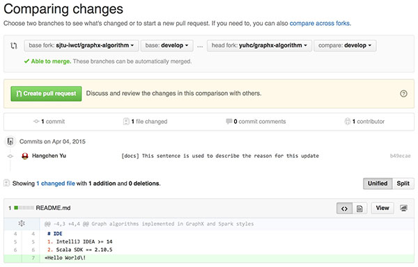

Contribute on GitHub
====================

About
-----

This tutorial describes how to help develop this project on GitHub [iWCT-GraphX-webpage](https://github.com/sjtu-iwct/graphx-webpage) and [iWCT-GraphX-algorithm](https://github.com/sjtu-iwct/graphx-algorithm). This tutorial uses [iWCT-GraphX-algorithm](https://github.com/sjtu-iwct/graphx-algorithm) as an example.

Note: This tutorial might be incomplete. Please help us by completing it for beginner users.

Intructions
-----------

### Step 1: Get GitHub Account

### Step 2: Set up Git

  * Follow the [GitHub Official Guide](https://help.github.com/articles/set-up-git/#setting-up-git)
  * Either choose HTTPS or SSH [authentication](https://help.github.com/articles/set-up-git/#next-steps-authenticating-with-github-from-git).

### Step 3: Clone and Modify the Project

  * Fork your own copy of [sjtu-iwct/graphx-algorithm](https://github.com/sjtu-iwct/graphx-algorithm/tree/develop) `develop` branch to your account (click the `Fork` icon on the top-right corner)
  * Go to your own copy such as `https://github.com/yuhc/graphx-algorithm`, copy the `CLONE_URL` on the right side
  * Clone the project to your computer by typing `git clone CLONE_URL` in your git terminal
  ```
  $ git clone https://github.com/yuhc/graphx-algorithm.git
  Cloning into 'graphx-algorithm'...
  remote: Counting objects: 52, done.
  remote: Compressing objects: 100% (15/15), done.
  remote: Total 52 (delta 0), reused 0 (delta 0), pack-reused 35
  Unpacking objects: 100% (52/52), done.
  Checking connectivity... done.
  ```

  * Switch to `develop` branch
  ```
  $ cd graphx-algorithm/
  $ git checkout -b develop origin/develop
  Branch develop set up to track remote branch develop from origin.
  Switched to a new branch 'develop'

  $ git pull
  Already up-to-date.
  ```

  * Edit or add some files
  ```
  $ echo "Hello World\!" >> README.md
  ```

### Step 4: Upload the Modification

  * Include the modified files to the upload queue (which is called `commit`)
  ```
  $ git add README.md
  ```
  * Upload your modification (this is called `commit and push`)
  ```
  $ git commit -m "[docs] This sentence is used to describe the reason for this update"
  [master b49ecae] [docs] This sentence is used to describe the reason for this update
   1 file changed, 1 insertion(+)

  $ git push
  Username for 'https://github.com': yuhc
  Password for 'https://yuhc@github.com': ******
  Counting objects: 1, done.
  Writing objects: 100% (1/1), 224 bytes | 0 bytes/s, done.
  Total 1 (delta 0), reused 0 (delta 0)
  To https://github.com/yuhc/graphx-algorithm.git
       67ee437..b49ecae  develop -> develop
  ```

### Step 5: Submit your Contribution!

  * Go back to your own copy such as `https://github.com/yuhc/graphx-algorithm`, click the `Pull request` button on the right side
  * Click `New pull request`, set the base fork and head fork (requesting the head fork to be merged into the base fork)
  [](images/pull_request.jpg)
  * Click `Greate pull request` button
  * Full out the description of your work and your reason for the work in the pull request page.

Advanced Intructions
--------------------

### Check the Status

  * git status
  ```
  $ git status
  On branch develop
  Your branch is up-to-date with 'origin/develop'.
  nothing to commit, working directory clean
  ```

### Switch between local branches

  * git checkout existed_branch_name
  ```
  $ git checkout master
  Switched to branch 'master'
  Your branch is up-to-date with 'origin/master'.
  ```

### Create New Branch

  * Create locally
  ```
  $ git branch new_branch_1
  $ git branch
       develop
  -> master
       new_branch_1
  ```

  * Create locally and switch to the new branch
  ```
  $ git checkout -b  new_branch_2
  Switched to a new branch 'new_branch_2'
  $ git branch
       develop
       master
       new_branch_1
  -> new_branch_2
  ```

  * Push the new local branch to the remote
  ```
  $ git push --set-upstream origin new_branch_2
  Total 0 (delta 0), reused 0 (delta 0)
  To https://github.com/yuhc/graphx-algorithm.git
   * [new branch]      new_branch_2 -> new_branch_2
  Branch new_branch_2 set up to track remote branch new_branch_2 from origin.
  ```

### Delete Existed Branch

  * Delete local branch
  ```
  $ git branch -d new_branch_2
  error: Cannot delete the branch 'new_branch_2' which you are currently on.
  $ git branch -d new_branch_1
  Deleted branch new_branch_1 (was f5ec94b).
  $ git branch
       develop
       master
  -> new_branch_2
  ```

  However, the remote branch is not affected
  ```
  $ git branch -r
  origin/HEAD -> origin/master
  origin/develop
  origin/gh-pages
  origin/master
  origin/new_branch_2
  ```

  * Delete remote branch
  ```
  $ git push origin :new_branch_2
  To https://github.com/yuhc/graphx-algorithm.git
   - [deleted]         new_branch_2
  $ git branch -r
    origin/HEAD -> origin/master
    origin/develop
    origin/gh-pages
    origin/master
  ```


Additional Notes
---------------

### Useful Websites

  * Learn Git at http://git-scm.com ([Chinese version](http://git-scm.com/book/zh) also available)
  * [Use SSH authentication](https://help.github.com/articles/generating-ssh-keys/)
